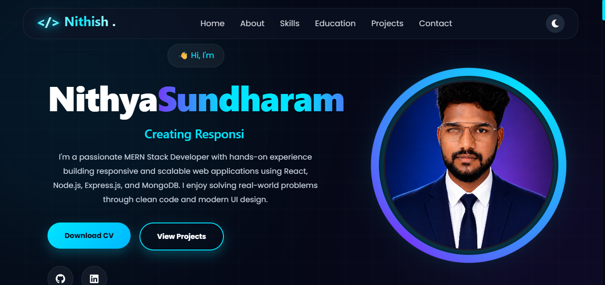

#  Nithish | Developer Portfolio

A modern and responsive personal portfolio showcasing my projects, technical skills, education, certifications, and contact information. Built to highlight my journey as a Full-Stack Web Developer and make it easy for recruiters and clients to explore my work.

##  Live Demo

  https://nithish-plum.vercel.app/

##  GitHub Repository

  https://github.com/vjnithish17/Nithish

##  Features

-  Modern Landing Page
-  About Me
-  Technical Skills
-  Education
-  Featured Projects
-  Certifications
-  Contact Section
-  Fully Responsive Design
-  Smooth Animations

##  Tech Stack

- React.js
- JavaScript (ES6+)
- HTML5
- CSS3
- Bootstrap 5
- React Router DOM

##  Screenshot



##  Installation

```bash
git clone https://github.com/vjnithish17/Nithish.git
cd Nithish
npm install
npm start
```

##  Deployment

- **Frontend:** https://nithish-plum.vercel.app/

##  Featured Projects

###  AI Expense Tracker
- AI-powered expense management application
- React.js, REST API, Groq AI Integration

###  Employee Management System
- Employee CRUD operations
- React.js, Axios, JSON Server

###  Dairy Farm Management System
- Milk collection and expense tracking dashboard
- React.js, Local Storage

##  Author

**Nithyasundharam E**

-  Portfolio: https://nithish-plum.vercel.app/
-  GitHub: https://github.com/vjnithish17
-  LinkedIn:https://www.linkedin.com/in/nithish-e-27b2822a5/
-  Email:vjnithish17@gmail.com

---

 If you like this project, don't forget to **Star** the repository!
